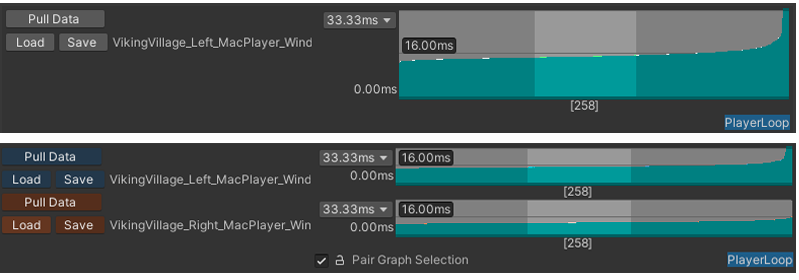

# Ordering frames by length

This workflow explains how to order the frame data in the Profile Analyzer by frame length, shortest to longest, which
results in an s-curve style graph. The Profile Analyzer groups frames with similar performance together, which enables
you to create sub-ranges over a set of similar performing frames without including any outliers. This is particularly
useful to normalize the data and to focus on only the shortest, longest, or average frames in the data set.

This workflow applies for both [Single view](single-view.md) and [Compare view](compare-view.md).

## Step 1: Collect performance data to analyze

Open the Profile Analyzer window (menu: **Window &gt; Analysis &gt; Profile Analyzer**) and collect some profiling data.
To pull data from an active profiling session, click the **Pull Data** button. This pulls in the current set of
available frames from the Profiler. If you don't have an active profile session, click the **Open Profiler Window**
button, then load or record some data.

For more information on how to collect data, see the workflow documentation
on [Collecting and viewing data](collecting-and-viewing-data.md).

## Step 2: Order the data set

If you are in the Compare view, enable the **Pair Graph Selection** checkbox. By default, the data set is ordered by
frame number. To order the frames by their length, right click on a graph in the Frame Control pane, and select **Order
by Frame Duration**.

The Profile Analyzer then orders the graph from shortest to longest frame.

## Step 3: Select frames of interest

Click and drag on the graph to select a range of frames with similar performance from the middle of the distribution.

 *Top, the Frame Control pane in Single
view, with the graph ordered by frame duration, and a range of frames selected. Bottom, the Frame Control pane in
Compare view, with the graph ordered by frame duration, and a range of frames selected.*

You can now use the Profile Analyzer to analyze data from frames that have a similar performance.
