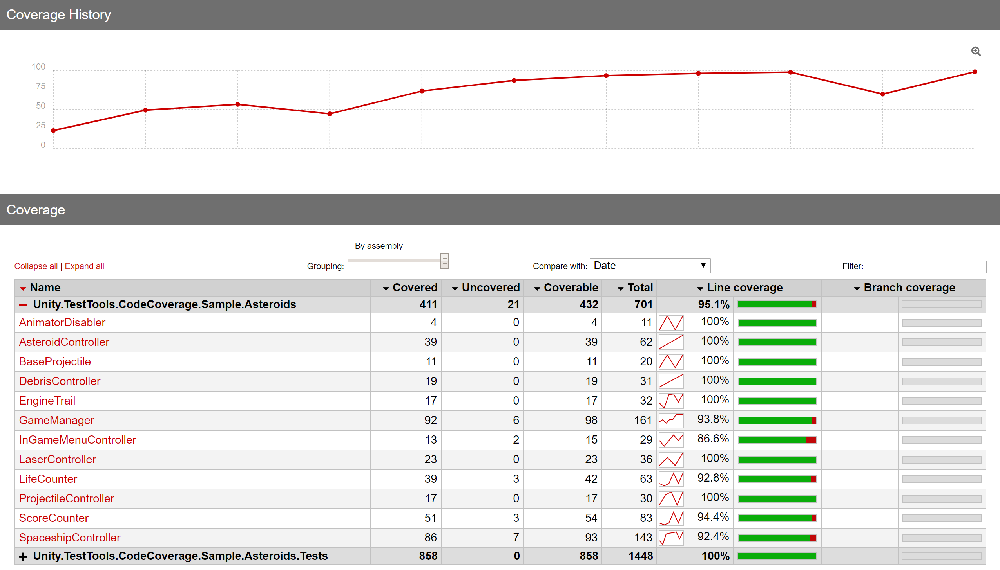

# How to interpret the results

This section assumes that you checked **HTML Report** in the [Code Coverage window](CodeCoverageWindow.md) or passed
the `generateHtmlReport` option in `-coverageOptions` on the [command line](CoverageBatchmode.md). If you're running the
tests in the Editor, a file viewer window opens up containing the coverage report once the test run has been finished.
If you're running the tests from the command line, navigate to the `-coverageResultsPath` location with your file
viewer. Open the `Report` folder then open `index.htm` in a web browser. This shows a summary of the coverage results
from the tests. 

## Summary view

The summary view is divided into several sections: Summary, Coverage History, Risk Hotspots and Coverage.

### Summary

This section shows a brief summary of the coverage results including the number of assemblies, classes, files and lines
that were processed. The most important value is the **Line Coverage** which shows the current coverage percentage of
all coverable lines. Coverable lines only include the lines that can be executed and are colored either green or red in
the [File(s)](#files) section depending on whether the line was covered or not. Uncoverable lines are the lines that
cannot be executed and are not colored in the [File(s)](#files) section; these include lines containing:

- Assemblies, Classes, Constructors, Methods and Structs that are marked to
  be [excluded from coverage](UsingCodeCoverage.md#excluding-code-from-code-coverage)
- Directives
- Attributes
- Method signatures
- Class definitions
- Unassigned variable declarations
- Constant variable declarations
- else/case/default keywords
- Lines from other classes, when multiple classes are included in the same file
- Blank lines

### Coverage History

This section only appears if you checked **Report History** in the [Code Coverage window](CodeCoverageWindow.md) or
passed the `generateHtmlReportHistory` option in `-coverageOptions` on the [command line](CoverageBatchmode.md). The
Coverage History displays a graph showing the total percentage coverage for every test run for this project. Aim to keep
this percentage as high as possible. If it is decreasing, consider writing more tests to improve your coverage.

### Risk Hotspots

This section only appears if you checked **Additional Metrics** in the [Code Coverage window](CodeCoverageWindow.md) or
passed the `generateAdditionalMetrics` option in `-coverageOptions` on the [command line](CoverageBatchmode.md).

The Risk Hotspots display information about any methods that have a Cyclomatic Complexity score that is greater than 15.
The Cyclomatic Complexity score is a value that is based on the number of paths that can be taken through a method. The
score will tend to be higher if a method has a large number of `if` or `switch` statements. For more detailed
information see the [Wikipedia entry on Cyclomatic Complexity](https://en.wikipedia.org/wiki/Cyclomatic_complexity). You
will also see information about any methods with a high Crap Score. CRAP stands for Change Risk Anti-Patterns. For more
detailed information see this [article](https://testing.googleblog.com/2011/02/this-code-is-crap.html).

If there are any methods with a very high Cyclomatic Complexity or Crap Score, consider refactoring the method to reduce
its complexity.

**Note:** NPath Complexity calculation and Branch Coverage are not implemented at present so will always appear as zero.

### Coverage

By default, this shows a list of the assemblies that have been covered together with some stats showing how well covered
they are. Select **Expand (+)** next to the assembly name to see a list of the classes or structs within the assembly
and their associated coverage data. To see more detailed information for a particular class, select its name in the
list.

## Class/Struct view

### Summary

Similar to the Summary section of the previous page, this section shows some brief statistics for the selected class.
The most important value is the Line Coverage percentage. Select **Back (<)** in the top left hand corner to return to
the previous screen.

### Coverage History

This section only appears if you checked **Report History** in the [Code Coverage window](CodeCoverageWindow.md) or
passed the `generateHtmlReportHistory` option in `-coverageOptions` on the [command line](CoverageBatchmode.md). It
shows a graph of the coverage percentage of the class/struct over time. Try to keep this value as high as you can. Make
sure that as you add new code the coverage percentage is maintained by adding more tests.

### Metrics

The metrics section displays a list of the methods and properties of the class, along with each method's Cyclomatic
Complexity, Crap Score and Sequence Coverage scores. Currently, the NPath Complexity and Branch Coverage aren't
calculated, so will always appear as zero.

### File(s)

The File(s) section shows the C# source code for the selected class. Each line is colored either green or red depending
on whether the line was covered or not. The number in the left column indicates the number of times that the line was
executed during a Test Runner or Coverage Recording session.

### Coverage by test methods

This section only appears if you checked **Test Runner References** in the [Code Coverage window](CodeCoverageWindow.md)
or passed the `generateTestReferences` option in `-coverageOptions` on the [command line](CoverageBatchmode.md).

It shows a list of test methods allowing you to see how each test contributes to the overall coverage. Select a test
method to view the relevant code or hover over the code to see which test method executed it.
