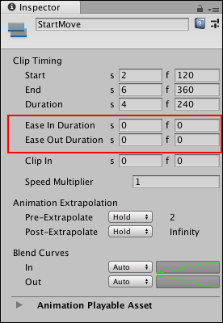
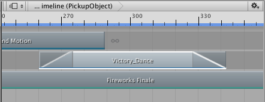
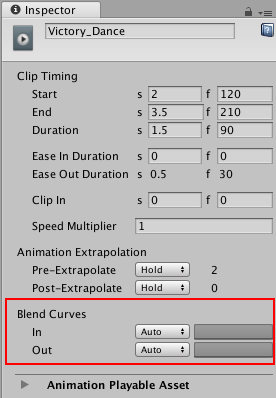
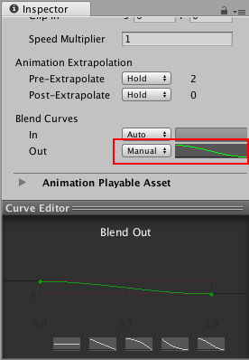
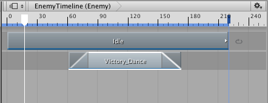

# Easing-in and easing-out clips

Ease-in and ease-out a clip to create a smooth transition between a clip and its surrounding gaps. To create an ease-in
or ease-out transition, select a clip and, in the Inspector window, set either the **Ease In Duration** or the **Ease
Out Duration**.

_Use Ease In Duration and Ease Out Duration to smoothly transition into and out of the selected clip._

Ease-in and ease-out transitions create different effects, depending on the track:

* On an Animation track or an Animation Override track, ease-in to an Animation clip to create a smooth transition
  between the animation in the gap before the clip and the Animation clip. Ease-out of an Animation clip to create a
  smooth transition between the Animation clip and the animation in the gap after the clip. For information on the
  factors that determine what animation occurs in the gap before and after an Animation clip,
  see [Setting gap extrapolation](clp_gap_extrap.md).

* On an Audio track, ease-in to an Audio clip to fade in the volume of the audio waveform. Ease-out of an Audio clip to
  fade out the volume of the audio waveform specified by the Audio clip.

* On a Playable track, ease-In to a Playable clip to fade in the effect or script in the Playable clip. Ease-out of a
  Playable clip to fade out the effect or script in the Playable clip.

_Ease-in and ease-out an Animation clip to transition between its animation and its gaps. Timeline represents ease-in
and ease-out transitions as a linear curve._

Although the Clips view represents an ease-in or ease-out transition as a single linear curve, every ease-in or ease-out
transition is actually set to a gradually easing-in or easing-out curve by default. To change the shape of either the
ease-in curve (labelled **In**) or the ease-out (labelled **Out**) curve, use the **Blend Curves** in the Inspector
window.

_Use the Blend Curves to customize ease-in or ease-out transitions_

Note that the **Blend Curves** might affect the blend area used for blending between two clips. The **Ease In Duration**
and **Ease Out Duration** properties indicate whether the **Blend Curves** affect an ease-in or ease-out transition, or
a blend. For example, If the **Ease Out Duration** is editable, then the Blend Out curve (labelled **Out**) affects the
curve used by an ease-out transition. If the **Ease Out Duration** is not editable, then the Blend Out curve (labelled *
*Out**) affects the outgoing clip in a blend between two clips.

_Ease Out Duration is not editable, therefore the **Out** curve affects the blend area between two clips_

To customize either the ease-in or ease-out transition, use the drop-down menu to switch from **Auto** to **Manual**.
With **Manual** selected, the Inspector window shows a preview of the blend curve. Click the curve preview to open the
Curve Editor below the Inspector window.

_Select Manual and click the preview to open the Curve Editor_

The Curve Editor is the same editor that is used to customize the shape of the blend curves
when [blending between clips](clp_blend.md).

When creating an ease-in or an ease-out transition with Animation clips, the Animation clip blends between its gaps and
the Animation clip. The following factors affect the values of animated properties in the gaps surrounding an Animation
clip:

* The [pre-extrapolate and post-extrapolate settings](clp_gap_extrap.md) for the Animation clip and for other Animation
  clips on the same track.
* Animation clips on other Animation tracks that are bound to the same GameObject.
* The position or animation of the GameObject in the Scene, outside the Timeline Asset.

## Gap extrapolation and easing clips

To successfully ease-in or ease-out an Animation clip, gap extrapolation must not be set based on the Animation clip
being eased-in or eased-out. Gap extrapolation must either be set to **None** or set by another Animation clip.

For example, the following ease-in transition has no effect because the Pre-Extrapolate for the Victory_Dance clip is
set to **Hold**. This means that the ease-in creates a transition between the first frame of the Animation clip and the
rest of the Animation clip.

_The gap is set to **Hold** from the Animation clip (circled). The ease-in transition has no effect._

_To ease-in from the Idle clip, set pre-extrapolate for the Victory_Dance clip to **None**. The ease-in gap uses the
post-extrapolate mode from the Idle clip (circled)._

## Overriding Animation tracks with ease-in and ease-out transitions

Use two Animation tracks bound to the same GameObject to create a smooth transition between two Animation clips.

For example, if two Animation tracks are bound to the same GameObject and a clip on the second track contains an ease-in
transition, the ease-in transition creates a smooth transition between the animation on the previous track and the
animation on the second track.

_Example of using two Animation tracks, bound to the same GameObject, to create smooth transitions between Animation
clips._

In this example, the Animation clip on the first track is a repeated idle cycle where the humanoid GameObject stands
still. The Animation clip in the second track eases-in the Victory_Dance motion and eases-out to return back to the idle
cycle

To successfully override animation on a previous track, the gap extrapolation for the second track must be set to **None
** so that the animation data in the gap is taken from the previous track bound to the same GameObject. The ease-in and
ease-out transitions use this animation data.
