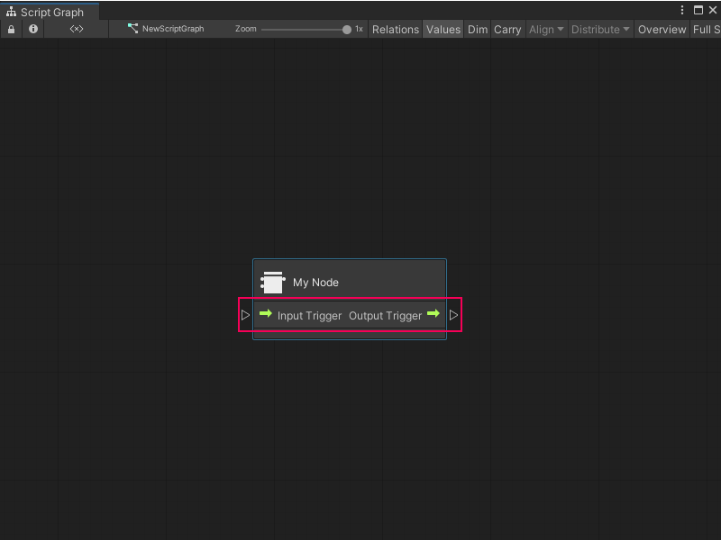

# Add ports to a Custom C# node

> [!NOTE]
> To add ports to your node, you must create the C# file for the
> node. [!include[vs-tasks-note-end](./snippets/custom-c-nodes/vs-tasks-note-end.md)]

After you create a Custom C# node, add ports to allow the node to send and receive data or trigger other nodes in a
Script Graph.

To add ports to a node:

1. [!include[open-project-window](./snippets/vs-open-project-window.md)]

2. [!include[open-existing-external-code](./snippets/vs-open-existing-external-code.md)]

## Add control ports

3. In your external editor, under the class definition for the node, add two public variables: one with a **ControlInput
   ** type and one with a **ControlOutput** type.

4. In the `Definition` method for the node, use the variables to define the control ports, as shown below:

    ```C#
    using System;
    using Unity.VisualScripting;
    using UnityEngine;

    public class MyNode : Unit
    {
    [DoNotSerialize] // No need to serialize ports.
    public ControlInput inputTrigger; //Adding the ControlInput port variable

    [DoNotSerialize] // No need to serialize ports.
    public ControlOutput outputTrigger;//Adding the ControlOutput port variable.

    protected override void Definition()
    {
        //Making the ControlInput port visible, setting its key and running the anonymous action method to pass the flow to the outputTrigger port.
        inputTrigger = ControlInput("inputTrigger", (flow) => { return outputTrigger; });
        //Making the ControlOutput port visible and setting its key.
        outputTrigger = ControlOutput("outputTrigger");
    }
    }

    ```
5. [!include[save-script](./snippets/vs-save-script.md)]

1. [!include[return-unity](./snippets/vs-return-unity.md)]

6. Do one of the following:
    - [!include[open-graph-w-node](./snippets/custom-c-nodes/vs-open-graph-w-node.md)].
    - [!include[ff-add-node](./snippets/custom-c-nodes/vs-ff-add-node.md)]

   If you used the previous code sample, Visual Scripting adds input and output control ports to the node.

   

## Add value ports

8. In your external editor, under the class definition for the node, add any number of variables with either a **Generic
   ** or specific type value:

    - **Generic**: The port can receive or output any data type. Corresponds to Unity's **Object** type.
    - **Specific Type Value**: The port can only receive or output a specific data type. For example, `string`, `float`,
      or `integer`.

   For more information on types in Visual Scripting, see [Object types](vs-types.md).

9. In the `Definition` method for the node, use the variables to define the value ports. In the example below, there are
   two input ports with a type value of `string`, and one `string` output port:

    ```C#
    using System;
    using Unity.VisualScripting;
    using UnityEngine;

    public class MyNode : Unit
    {
    [DoNotSerialize]
    public ControlInput inputTrigger;

    [DoNotSerialize]
    public ControlOutput outputTrigger;

    [DoNotSerialize] // No need to serialize ports
    public ValueInput myValueA; // Adding the ValueInput variable for myValueA

    [DoNotSerialize] // No need to serialize ports
    public ValueInput myValueB; // Adding the ValueInput variable for myValueB

    [DoNotSerialize] // No need to serialize ports
    public ValueOutput result; // Adding the ValueOutput variable for result

    private string resultValue; // Adding the string variable for the processed result value
    protected override void Definition()
    {
        inputTrigger = ControlInput("inputTrigger", (flow) => { return outputTrigger; });
        outputTrigger = ControlOutput("outputTrigger");
        
        //Making the myValueA input value port visible, setting the port label name to myValueA and setting its default value to Hello.
        myValueA = ValueInput<string>("myValueA", "Hello ");
        //Making the myValueB input value port visible, setting the port label name to myValueB and setting its default value to an empty string.
        myValueB = ValueInput<string>("myValueB", string.Empty);
        //Making the result output value port visible, setting the port label name to result and setting its default value to the resultValue variable.
        result = ValueOutput<string>("result", (flow) => { return resultValue; });
    }
    }

    ```
5. [!include[save-script](./snippets/vs-save-script.md)]

1. [!include[return-unity](./snippets/vs-return-unity.md)]

11. Do one of the following:
    - [!include[open-graph-w-node](./snippets/custom-c-nodes/vs-open-graph-w-node.md)].
    - [!include[ff-add-node](./snippets/custom-c-nodes/vs-ff-add-node.md)]

    If you used the previous code sample, Visual Scripting adds two input ports, **My Value A** and **My Value B**, and
    one output port, **Result** to the node.

    

## Next steps

After you add ports to a node, [add logic](vs-create-custom-node-add-logic.md) to tell the node what to do with the data
it receives.
