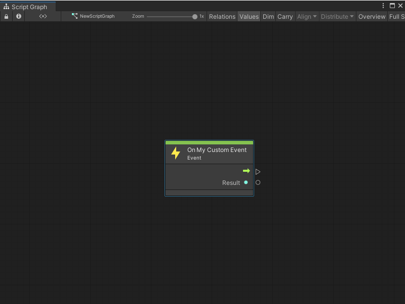

# Create a Custom Scripting Event node

You can create a Custom Scripting Event node with a C# script. With C#, you can customize all aspects of your Custom
Scripting Event, unlike a Visual Scripting custom Event. For more information on the different types of custom Events,
see [Custom Events](vs-custom-events.md).

To create a Custom Scripting Event node:

1. [!include[open-project-window](./snippets/vs-open-project-window.md)]

1. [!include[right-click-project](./snippets/custom-events/vs-right-click-project.md)]

1. [!include[create-c-script-project](./snippets/vs-create-c-script-project.md)]

1. Enter a name, such as `MyEventNode`, for the new script file.

1. Press Enter.

1. [!include[open-new-external-code](./snippets/vs-open-new-external-code.md)]

1. In your external editor, copy and paste the following code into the C# script:

    ```csharp
   using Unity.VisualScripting;
   using UnityEngine;
   
   //Register a string name for your Custom Scripting Event to hook it to an Event. You can save this class in a separate file and add multiple Events to it as public static strings.
   public static class EventNames
   {
      public static string MyCustomEvent = "MyCustomEvent";
   }
   
   [UnitTitle("On my Custom Event")]//The Custom Scripting Event node to receive the Event. Add "On" to the node title as an Event naming convention.
   [UnitCategory("Events\\MyEvents")]//Set the path to find the node in the fuzzy finder as Events > My Events.
   public class MyCustomEvent : EventUnit<int>
   {
      [DoNotSerialize]// No need to serialize ports.
      public ValueOutput result { get; private set; }// The Event output data to return when the Event is triggered.
      protected override bool register => true;
      
      // Add an EventHook with the name of the Event to the list of Visual Scripting Events.
      public override EventHook GetHook(GraphReference reference)
      {
          return new EventHook(EventNames.MyCustomEvent);
      }
      protected override void Definition()
      {
          base.Definition();
          // Setting the value on our port.
          result = ValueOutput<int>(nameof(result));
      }
      // Setting the value on our port.
      protected override void AssignArguments(Flow flow, int data)
      {
          flow.SetValue(result, data);
      }
   }
    ```
1. [!include[save-script](./snippets/vs-save-script.md)]

1. [!include[return-unity](./snippets/vs-return-unity.md)]

1. [!include[regen-node-library](./snippets/vs-regen-node-library.md)]

1. [Open a Script Graph](vs-open-graph-edit.md) where you want to add your new node.

1. [!include[open-fuzzy-finder](./snippets/vs-open-fuzzy-finder.md)].

1. Go to **Events** &gt; **My Events**.

1. Select your **On My Custom Event** node to add it to the graph.

   > [!NOTE]
   > If you change the `UnitTitle` or `UnitCategory` attributes for the node in your code, the node appears in the
   location in the fuzzy finder with the name that you specify.

   

After you regenerate your Node Library, the Custom Scripting Event node appears in the fuzzy finder. If you didn't
change the `[UnitCategory]` or `[UnitTitle]` from the sample code, then the fuzzy finder displays the node under *
*Events** &gt; **MyEvents**, as the **On my Custom Event** node. For more information on the fuzzy finder,
see [The interface](vs-interface-overview.md#the-fuzzy-finder).

## Next steps

After you create your Custom Scripting Event node, you
can [create a Custom Scripting Event Sender node](vs-create-own-custom-event-send-node.md) to trigger your Event from
another Script Graph or location in the same Script Graph. You can
also [create a script to trigger your Event from code](vs-create-own-custom-event-node-trigger-code.md)
or [create a script to listen to your Event](vs-create-own-custom-event-listen-code.md).
