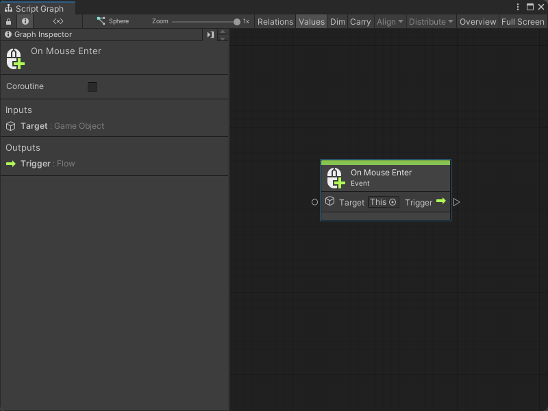
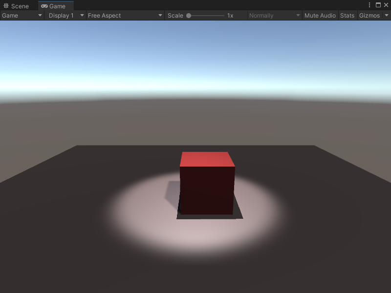

# On Mouse Enter node

> [!NOTE]
> The On Mouse Enter [!include[nodes-note-manual](./snippets/input-manager/nodes-note-manual.md)]

The On Mouse Enter node listens for the user's mouse pointer location to enter the Collider of a specified GameObject.
When the mouse enters the Collider or GUI element, the node triggers the next node connected to it. It doesn't send or
receive any other data.

## Fuzzy finder category

The On Mouse Enter node is in the **Events** &gt; **Input** category in the fuzzy finder.

## Inputs

The On Mouse Enter [!include[nodes-single-input](./snippets/nodes-single-input.md)]

| **Name**   | **Type**   | **Description**                                                         |
|:-----------|:-----------|:------------------------------------------------------------------------|
| **Target** | GameObject | The GameObject with the Collider that triggers the On Mouse Enter node. |

## Additional node settings

The On Mouse Enter [!include[nodes-additional-settings](./snippets/nodes-additional-settings.md)]

<table>
<thead>
<tr>
<th><strong>Name</strong></th>
<th><strong>Type</strong></th>
<th><strong>Description</strong></th>
</tr>
</thead>
<tbody>
[!include[nodes-coroutine](./snippets/nodes-coroutine.md)]
</tbody>
</table>

## Outputs

The On Mouse Enter [!include[nodes-single-output](./snippets/nodes-single-output.md)]

<table>
<thead>
<tr>
<th><strong>Name</strong></th>
<th><strong>Type</strong></th>
<th><strong>Description</strong></th>
</tr>
</thead>
<tbody>
[!include[nodes-input-output-trigger](./snippets/input-manager/nodes-input-output-trigger.md)]
</tbody>
</table>

## Example graph usage

In the following example, the On Mouse Enter node triggers the Instantiate GameObject node when the user's mouse enters
the Collider on the Script Machine's GameObject. The Instantiate node creates an instance of the **Light** Prefab, at
the Prefab's **Position** and with the Prefab's **Rotation**. The graph saves the new instance of the GameObject to a
Scene variable, **Spotlight**, so it can interact with the GameObject again later.

![An image of the Graph window. An On Mouse Enter node's Trigger output port connects to the Invoke input port on an Instantiate GameObject node. The Instantiate GameObject's Original uses an inline value of the project's Light Prefab. A GameObject Literal node also uses the Light Prefab as an inline value. The GameObject Literal connects to a Transform Get Position node and a Transform Get Rotation node, which provide the Position and Rotation inputs for the Instantiate GameObject node. The Instantiate GameObject node's Exit port triggers the Assign input port on the Set Variable node, and assigns the new GameObject as the value of the Spotlight Scene variable.](images/vs-nodes-events-on-mouse-enter-example.png)

The result is a spotlight that appears over the On Mouse Enter node's **Target** GameObject, when the user's mouse
enters the Collider.

## Related nodes

[!include[nodes-related](./snippets/nodes-related.md)] On Mouse Enter node:

- [On Button Input node](vs-nodes-events-on-button-input.md)
- [On Keyboard Input node](vs-nodes-events-on-keyboard-input.md)
- [On Mouse Down node](vs-nodes-events-on-mouse-down.md)
- [On Mouse Drag node](vs-nodes-events-on-mouse-drag.md)
- [On Mouse Exit node](vs-nodes-events-on-mouse-exit.md)
- [On Mouse Input node](vs-nodes-events-on-mouse-input.md)
- [On Mouse Over node](vs-nodes-events-on-mouse-over.md)
- [On Mouse Up node](vs-nodes-events-on-mouse-up.md)
- [On Mouse Up As Button node](vs-nodes-events-on-mouse-up-button.md)

